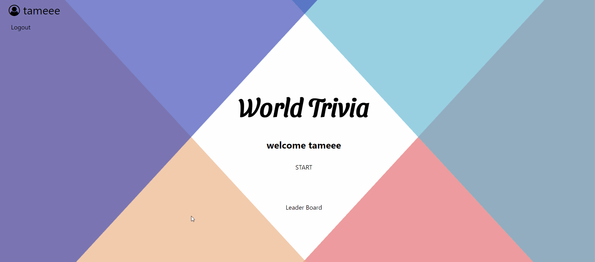

# 🌎 World Trivia

Test yourself!
You think you know everything about the world? 🤯
This trivia is just for you!

## How to play

Register or log in (after you signed up), click on play and that's it!

## Rules

You have 3 strikes.
You start from 20 seconds to answer a question, if you had a right answer the timer will drops 0.5 seconds, until you get to 5 seconds. If you had a wrong answer the timer won't change.

Be Quick! your score depends on how fast you will answer!

The smartest person will win the game!

## Setup in localhost

1. Fork this repository
2. Clone it to your computer
3. Create .env file in backend folder
4. Add the following variables that will match to your file:
   ACCESS_TOKEN_SECRET=""
   REFRESH_TOKEN_SECRET=""
   DB_PASSWORD=""
5. Install project dependencies by running `npm i` in the backend & trivia folders
6. Change the config file that will match your SQL
7. Go to the terminal, run `cd backend`
8. Run `npx sequelize db:migrate` to get all the tables
9. Run `npx sequelize db:seed:all` to get the data in the tables
10. Run `npm run dev` to start the backend
11. Open another terminal and run `cd trivia` and `npm start` to start the game

ENJOY!
